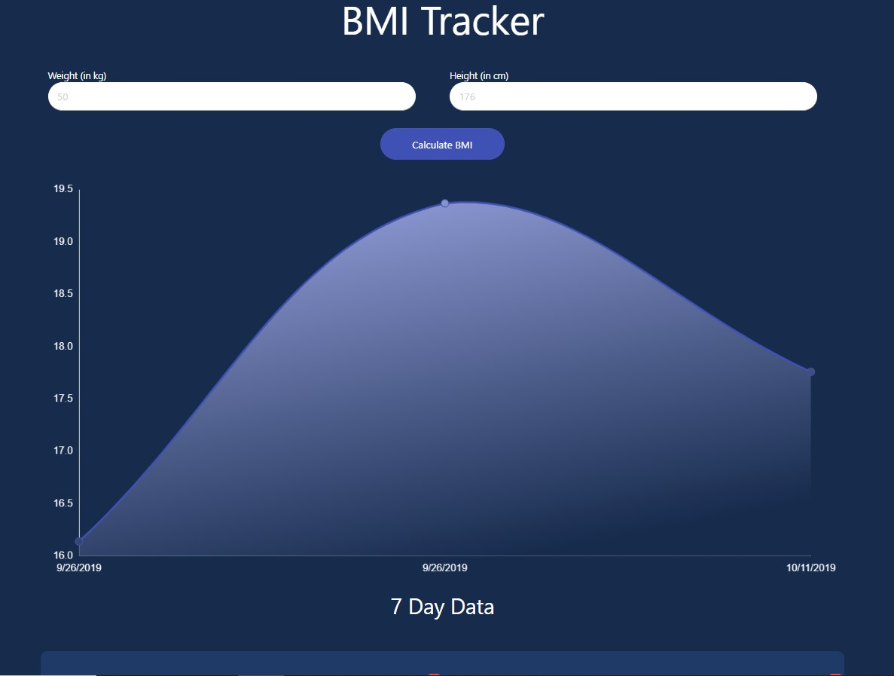

## BMI Calculator

React Hooks app to calculate the BMI of a person. It can store the data for 7 days with the help of LocalStorage.

Created with _create-react-app_. See the [full create-react-app guide](https://github.com/facebookincubator/create-react-app/blob/master/packages/react-scripts/template/README.md).

## Install

`npm install`

## Usage

`npm start`

## Enhancement

1. Removing the dependency of Materialize-CSS module
2. Adding the functionality of editing the weight and height
3. Chart going crazy on hovering over the old points
